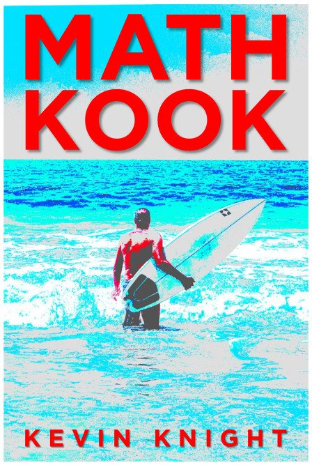

 
### book: <a href="https://www.amazon.com/">get it here</a>

### contact: <a href="mailto:math.kook.book@gmail.com">math.kook.book@gmail.com</a>

 

### code: <a href="math-kook.nb">.nb file</a>

### errata: <a href="errata.html">small fixes</a>

### sister site: <a href="https://www.youtube.com/playlist?list=PL4lTtiG6es54CW3vr5yKm99TcTLAaE0kE">youtube</a>

### also by the author: <a href="https://www.amazon.com">In theory</a> (2022), <a href="https://www.amazon.com/Artificial-Intelligence-Elaine-Rich/dp/0070522634/ref=sr_1_2?crid=14AZ5I9B1ISN1&amp;keywords=kevin+knight+artificial+intelligence&amp;qid=1659386396&amp;sprefix=kevin+knight+artificial+intelligenc%2Caps%2C161&amp;sr=8-2)">Artificial Intelligence</a> (1990)

  
### about the author: <a href="https://kevincrawfordknight.github.io/">Kevin Knight</a> has served as a professor of computer science, chief scientist at three artificial intelligence companies, and president of his international scientific society. He is currently splitting his time between indoors and outdoors. 
